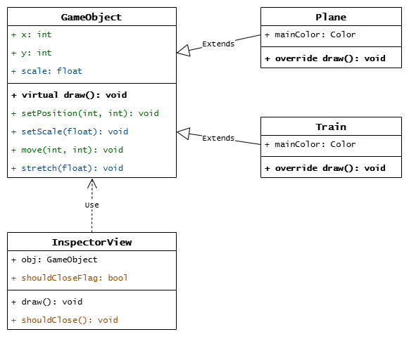
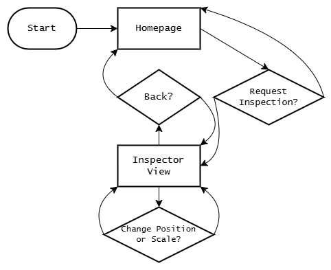
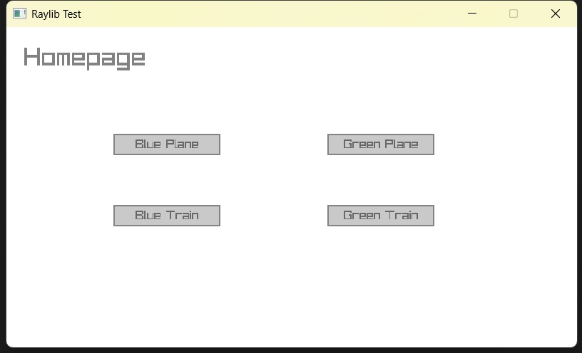
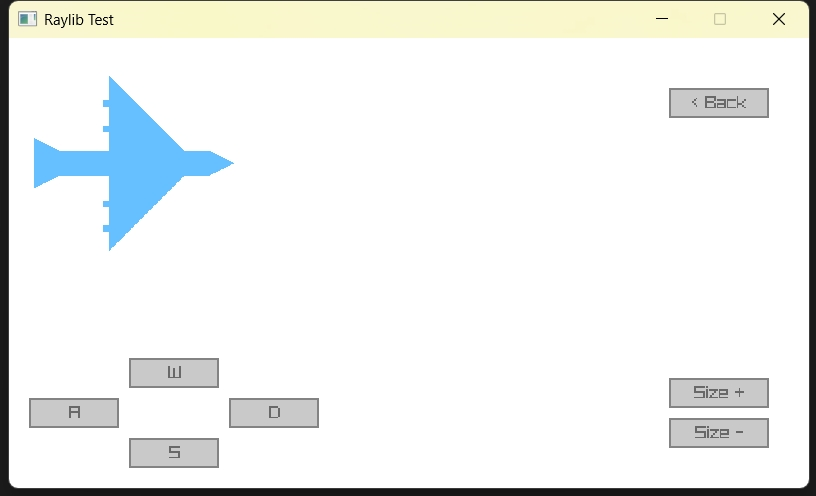
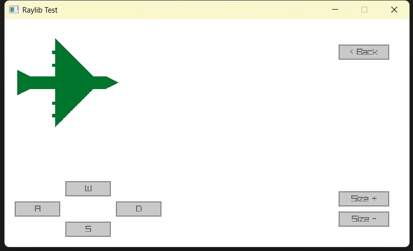
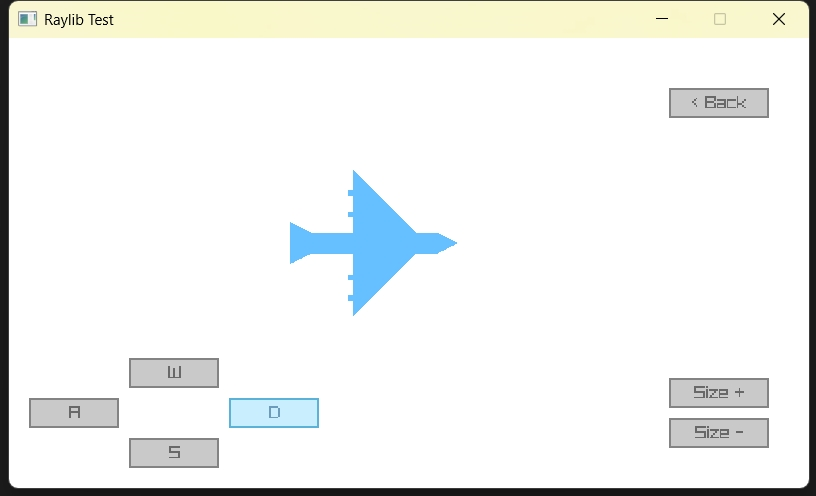
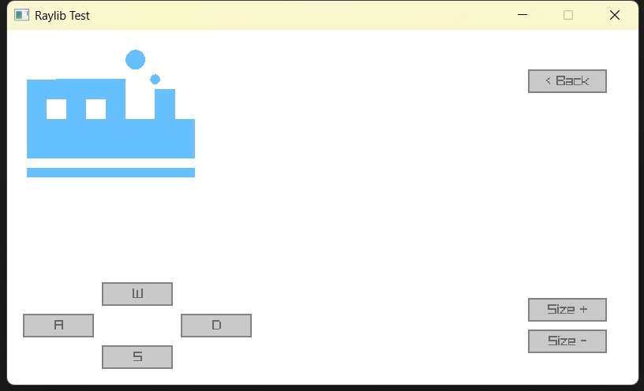

<div align="center">
    <h1 style="font-size:xx-large">
        <b>面向对象编程图形界面的实现报告</b>
    </h1>
    <p>
        <!--b>班级 姓名 学号</b-->
    </p>
    <br>
</div>

## 一，摘要

> 由于 Word 文档对代码文本的显示不美观，特此采用 Markdown PDF 的形式写作此报告。

本报告记录了使用 **Raylib 库**实现的面向对象编程的简单图形界面，该界面能够显示不同颜色的**两类图形对象**，并且能够对图形对象进行**移动和缩放**操作。

<br>

-----

## 二，设计思路

所有图形类都**继承自 `GameObject` 基类**，它提供了用于绘图的虚函数 `draw`（基于多态的思想，派生类将会分别实现它）。`GameObject` 还具有位置（`x` `y` 坐标）和缩放（`scale`）这些必要的基础数据，并提供修改位置和缩放的函数。

此外，还设计了一个 `InspectorView` 类作为 `GameObject` 对象的容器，它负责代理调用 `GameObject` 对象的相关函数，以此来提供针对图形对象的 GUI 交互功能。

下图展示了各个类的**架构和关系**：

<div align="center">
    
</div>

<br>

下图展示了程序的**运行流程**：

<div align="center">
    
</div>

<br>

-----

## 三，效果演示

### 初始界面

初始界面提供 4 个按钮，分别能够检视**蓝色飞机、绿色飞机、蓝色火车、绿色火车**共 4 种样式的图形。下图是初始界面的实机效果：

<div align="center">
    
</div>

### 检视界面

检视界面提供能够显示指定样式的图形，并且提供**返回、移动、缩放**的操作。下图是蓝色飞机和绿色飞机的检视界面：

<div align="center">
    
    
</div>

可以通过点击移动按钮，或按下键盘上对应的按键来移动或缩放图形。下图展示了移动并缩小后的蓝色飞机：

<div align="center">
    
</div>

除了飞机类之外，火车类也支持上述功能。下图是蓝色火车的检视界面：

<div align="center">
    
</div>

<div style="page-break-after:always"></div>

-----

## 四，代码实现

### GameObject.h

```cpp
#pragma once
#include <math.h>
#include "raylib.h"

namespace RaylibTest {
	class GameObject {
	public:
		GameObject();
		// Draws the object to the screen.
		virtual void draw();
		// Sets the position.
		void setPosition(int x, int y);
		// Sets the scale.
		void setScale(float scale);
		// Updates the position by the given value.
		void move(int dx, int dy);
		// Updates the scale by the given value.
		void stretch(float dScale);
	protected:
		int x;
		int y;
		double scale;
	};
}
```

### GameObject.cpp

```cpp
#include "GameObject.h"

namespace RaylibTest {
	GameObject::GameObject() {
		x = 0;
		y = 0;
		scale = 1.0f;
	}

	void GameObject::draw() {
	}

	void GameObject::setPosition(int x, int y) {
		this->x = x;
		this->y = y;
	}

	void GameObject::setScale(float scale) {
		this->scale = scale;
	}

	void GameObject::stretch(float dScale) {
		this->scale += dScale;
	}

	void GameObject::move(int dx, int dy) {
		this->x += dx;
		this->y += dy;
	}
}
```

### Plane.h

```cpp
#pragma once
#include "GameObject.h"

namespace RaylibTest {
	class Plane : public GameObject {
	public:
		Plane();
		Plane(Color color);
		void draw() override;
	protected:
		Color mainColor;
	};
}
```

### Plane.cpp

```cpp
#include "raylib.h"
#include "Plane.h"

namespace RaylibTest {
	Plane::Plane() {
		mainColor = GRAY;
	}

	Plane::Plane(Color color) {
		mainColor = color;
	}

	void Plane::draw() {
		Image img = GenImageColor(1000, 1000, BLANK);

		// Draw shapes
		ImageDrawRectangle(&img, 150, 450, 650, 100, mainColor); // Body
		ImageDrawTriangle(&img, Vector2{ 800, 450 }, Vector2{ 800, 550 }, Vector2{ 900, 500 }, mainColor); // Head
		ImageDrawTriangle(&img, Vector2{ 100, 400 }, Vector2{ 100, 600 }, Vector2{ 300, 500 }, mainColor); // Tail
		ImageDrawTriangle(&img, Vector2{ 400, 150 }, Vector2{ 400, 450 }, Vector2{ 700, 450 }, mainColor); // Wing
		ImageDrawTriangle(&img, Vector2{ 400, 850 }, Vector2{ 400, 550 }, Vector2{ 700, 550 }, mainColor); // Wing
		ImageDrawRectangle(&img, 375, 250, 25, 25, mainColor); // Deco
		ImageDrawRectangle(&img, 375, 350, 25, 25, mainColor); // Deco
		ImageDrawRectangle(&img, 375, 650, 25, 25, mainColor); // Deco
		ImageDrawRectangle(&img, 375, 750, 25, 25, mainColor); // Deco

		// Render texture
		BeginDrawing();
		ClearBackground(WHITE);
		Texture tex = LoadTextureFromImage(img);
		DrawTextureEx(tex, Vector2{ (float)x, (float)y }, 0.0f, scale, WHITE);
		EndDrawing();

		// Release resources
		UnloadImage(img);
		UnloadTexture(tex);
	}
}
```

### Train.h

```cpp
#pragma once
#include "GameObject.h"

namespace RaylibTest {
	class Train : public GameObject {
	public:
		Train();
		Train(Color color);
		void draw() override;
	protected:
		Color mainColor;
	};
}
```

### Train.cpp

```cpp
#include "Train.h"

namespace RaylibTest {
	Train::Train() {
	}

	Train::Train(Color color) {
		mainColor = color;
	}

	void Train::draw() {
		Image img = GenImageColor(1000, 1000, BLANK);

		// Draw shapes
		ImageDrawRectangle(&img, 100, 250, 500, 400, mainColor); // Body
		ImageDrawRectangle(&img, 600, 450, 350, 200, mainColor); // Head
		ImageDrawRectangle(&img, 750, 300, 100, 150, mainColor); // Head
		ImageDrawRectangle(&img, 100, 700, 850, 50, mainColor);  // Wheel
		ImageDrawRectangle(&img, 200, 350, 100, 100, WHITE); // Window
		ImageDrawRectangle(&img, 400, 350, 100, 100, WHITE); // Window
		ImageDrawCircle(&img, 650, 150, 50, mainColor); // Bubble
		ImageDrawCircle(&img, 750, 250, 25, mainColor); // Bubble

		// Render texture
		BeginDrawing();
		ClearBackground(WHITE);
		Texture tex = LoadTextureFromImage(img);
		DrawTextureEx(tex, Vector2{ (float)x, (float)y }, 0.0f, scale, WHITE);
		EndDrawing();

		// Release resources
		UnloadImage(img);
		UnloadTexture(tex);
	}
}
```

### InspectorView.h

```cpp
#pragma once
#include "GameObject.h"

namespace RaylibTest {
	class InspectorView {
	public:
		InspectorView(GameObject* obj);
		// Draws the inspector view with the wrapped object.
		void draw();
		// Returns true if the inspector should be closed.
		bool shouldClose();
	protected:
		GameObject* obj;
		bool shouldCloseFlag;
	};
}
```

### InspectorView.cpp

```cpp
#include "InspectorView.h"

#include "raylib.h"
#include "raygui.h"

#define W 800
#define H 450
#define STEP_P 5
#define STEP_S 0.01

namespace RaylibTest {
	InspectorView::InspectorView(GameObject* obj) {
		this->obj = obj;
		this->shouldCloseFlag = false;
	}

	void InspectorView::draw() {
		// Draw the object
		obj->draw();

		// Show moving controls
		if (GuiButton(Rectangle{ 20, H - 90, 90, 30 }, "A") || IsKeyPressed('A') || IsKeyPressed(KEY_LEFT)) {
			obj->move(-STEP_P, 0);
		}
		if (GuiButton(Rectangle{ 220, H - 90, 90, 30 }, "D") || IsKeyPressed('D') || IsKeyPressed(KEY_RIGHT)) {
			obj->move(STEP_P, 0);
		}
		if (GuiButton(Rectangle{ 120, H - 130, 90, 30 }, "W") || IsKeyPressed('W') || IsKeyPressed(KEY_UP)) {
			obj->move(0, -STEP_P);
		}
		if (GuiButton(Rectangle{ 120, H - 50, 90, 30 }, "S") || IsKeyPressed('S') || IsKeyPressed(KEY_DOWN)) {
			obj->move(0, STEP_P);
		}

		// Show scaling controls
		if (GuiButton(Rectangle{ W - 140, H - 110, 100, 30 }, "Size +") || IsKeyPressed('=')) {
			obj->stretch(STEP_S);
		}
		if (GuiButton(Rectangle{ W - 140, H - 70, 100, 30 }, "Size -") || IsKeyPressed('-')) {
			obj->stretch(-STEP_S);
		}

		// Show exit controls
		if (GuiButton(Rectangle{ W - 140, 50, 100, 30 }, "< Back") || IsKeyPressed(KEY_BACKSPACE)) {
			shouldCloseFlag = true;
		}
	}

	bool InspectorView::shouldClose() {
		return shouldCloseFlag;
	}
}
```

### Main.cpp

```cpp
#include <math.h>

#include "raylib.h"
#define RAYGUI_IMPLEMENTATION
#include "raygui.h"

#include "InspectorView.h"
#include "Plane.h"
#include "Train.h"

using namespace RaylibTest;

int main() {
	// Initialization
	InitWindow(800, 450, "Raylib Test");
	SetTraceLogLevel(LOG_WARNING);
	SetTargetFPS(30);
	GuiSetStyle(DEFAULT, TEXT_SIZE, 18);

	InspectorView* view = nullptr;
	GameObject* obj = nullptr;

	// Render loop
	while (!WindowShouldClose()) {
		if (view == nullptr) {
			// Goto homepage
			BeginDrawing();
			ClearBackground(WHITE);
			DrawText("Homepage", 25, 25, 36, GRAY);
			EndDrawing();

			if (GuiButton(Rectangle { 150, 150, 150, 30 }, "Blue Plane")) {
				obj = new Plane(SKYBLUE);
			}
			if (GuiButton(Rectangle { 150, 250, 150, 30 }, "Blue Train")) {
				obj = new Train(SKYBLUE);
			}
			if (GuiButton(Rectangle{ 450, 150, 150, 30 }, "Green Plane")) {
				obj = new Plane(DARKGREEN);
			}
			if (GuiButton(Rectangle{ 450, 250, 150, 30 }, "Green Train")) {
				obj = new Train(DARKGREEN);
			}
			if (obj != nullptr) {
				obj->setScale(0.25);
				view = new InspectorView(obj);
			}
		} else {
			// Goto inspector
			view->draw();
			if (view->shouldClose()) {
				delete view;
				view = nullptr;
				delete obj;
				obj = nullptr;
			}
		}
	}

	CloseWindow();
	return 0;
}
```

-----

> 相关代码已开源至 GitHub： https://github.com/isHarryh/USTB-Term-Assignments/tree/main/CppProgramming/RaylibTest
