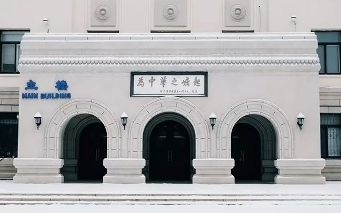

# 基于向量相似度的图像模式识别技术复现

## 一，问题描述

**图像（Image）** 是视觉信息传递的媒介。人与环境的交互、机器与环境的交互都离不开对图像的处理。

现在给定一幅大图像和一幅小图像（下称“模板图”），如下所示：

<div align="center">
    
    <br>
    <sup>图1：大图像（北京科技大学主楼）</sup>
    <br>
    
    <br>
    <sup>图2：模板图（牌匾文字）</sup>
    <br>
</div>


如何判断模板图是否在大图像中有出现？如果有出现，如何确定它出现的位置和次数？

这是一个典型的 **模式识别（Pattern Recognition）** 问题，而运用我们所学的线性代数的知识，可以巧妙地解决这个问题。

## 二，解决方法

### 2.1. 问题建模

图像是具有一定的像素宽度和高度，统称为分辨率（Resolution）。

<div align="center">
    
    <br>
    <sup>图3：图像及其分辨率的示意（来源于 ExposureGuide）</sup>
    <br>
</div>

一幅灰度图像可以被视作一个矩阵，矩阵的列数就是图像的像素宽度（Width），矩阵的行数就是图像的像素高度（Height），灰度数值就是矩阵的元素。

因此，我们可以先将大图像和模板图都转化为相应的两个矩阵。假设大图像的矩阵是 $A_{h_1w_1}$，模板图的矩阵是 $B_{h_2w_2}$

然后，将模板图从大图像的左上角 $x=0,y=0$ 开始，截取一个 $h_2 \times w_2$ 的子图像，比较子图像和模板图的相似度，记作 $s_{xy}$。接着，向右和向下“滑动”该子图像的截取区域，并依次进行截取和比较。此时，所有位置的相似度将形成一个矩阵 $S$。这样的操作有点类似于卷积神经网络（CNN）中的滑动感受野的行为。

<div align="center">
    
    <br>
    <sup>图4：对原始图像应用感受野的示意（来源于 Nibivid）</sup>
    <br>
</div>

最后，指定一个相似度阈值 $t$，如果矩阵 $S$ 中 $\exist s_{ij}$ 使得 $s_{ij} \geq t$，那么说明该模板图存在于大图像中。

### 2.2. 所需的线性代数知识点

那么，如何比较子图像和模板图的相似度呢？

对于两个矩阵，常见的相似度度量包括：

1. **归一化互相关值（CCORR_NORMED）**：  
   它和余弦相似度非常类似（度量两个向量的方向的相似程度），其公式如下：
   ```math
   \text{s}(T, W) = \frac{\sum_{i,j} T(x+i, y+j) \cdot W(i, j)}{\sqrt{\sum_{i,j} T(x+i, y+j)^2 \cdot \sum_{i,j} W(i, j)^2}}
   ```
   其中 $T(x+i, y+j)$ 和 $W(i, j)$ 分别是模板和子图的具体像素值。分子计算的是向量的点积，分母计算的是向量的模。不难发现，当 $\text{s}(u,v) \rightarrow 0$ 时，两个向量的夹角也趋近于零，表明二者的重合度很高。

2. **归一化互相关系数（CCOEFF_NORMED）**：  
   它与 (1) 的区别在于，我们提前对大图像和模板图的像素值进行了归一化，显著提升了抗干扰性。其公式为：
   ```math
   \text{s}(T, W) = \frac{\sum_{i,j} (T(x+i, y+j) - \bar{T})(W(i, j) - \bar{W})}{\sqrt{\sum_{i,j} (T(x+i, y+j) - \bar{T})^2 \cdot \sum_{i,j} (W(i, j) - \bar{W})^2}}
   ```
   其中 $T(x+i, y+j)$ 和 $W(i, j)$ 分别是模板和子图的具体像素值，$\bar{T}$ 和 $\bar{W}$ 是它们的全图平均像素值。

3. **平方差（SQ_DIFF）**：
   ```math
   \text{s}(T, W) = \sum_{i,j} (T(x+i, y+j) - W(i, j))^2
   ```
   平方差计算法有点类似于欧氏距离（L2 范数），它一定程度地表征了向量间的绝对差异，越小表示越相似。但是，平方差计算法对相对差异的鲁棒性较差。

在本文中，我们采用**归一化互相关系数**方法进行模式匹配。

### 2.3. 问题求解步骤

1. 预处理图像：  
   将大图像和模板图分别转换为灰度矩阵，并标准化矩阵值到范围 $[0, 1]$，使整体图像的像素值的方差 $\sigma = 1$，均值 $\mu = 0$。

2. 滑动感受野，比较相似度：  
   使用滑动感受野机制，从大图像中提取与模板图同尺寸的子图像，计算子图像与模板图的 CCOEFF_NORMED 相似度。在CCOEFF_NORMED 公式中，分子是点积，分母是向量的模长的乘积，其实也就是标准差的乘积。由于我们提前对子图和模板图进行了标准化（已经除以标准差了），所以不需要分母，而直接将标准化后的二图作点积运算。

3. 记录高相似度位置，输出结果：  
   在结果矩阵中找最高值，视作匹配结果。

## 三，结果演示

### 3.1. 代码实现

以下是 Python 代码实现：

```python
from PIL import Image, ImageDraw
import numpy as np

def read_image_as_array(image_path):
    """读取图像并转换为灰度数组"""
    return np.array(Image.open(image_path).convert('L'))

def template_match_ccoeff_normed(big_image, template):
    """使用 CCOEFF_NORMED 方法进行匹配"""
    h_big, w_big = big_image.shape
    h_temp, w_temp = template.shape

    # 准备存储运算结果的矩阵
    result = np.zeros((h_big - h_temp + 1, w_big - w_temp + 1))

    # 对模板图进行标准化
    normed_template = (template - template.mean()) / template.std()

    # 遍历大图像
    for y in range(result.shape[0]):
        for x in range(result.shape[1]):
            # 提取当前感受野中的子图像
            window = big_image[y:y + h_temp, x:x + w_temp]
            # 对子图像进行标准化
            window_std = window.std()
            if window_std > 0:
                normed_window = (window - window.mean()) / window_std
                # 计算 CCOEFF_NORMED：
                # 分子是点积，分母是向量的模长的乘积，也就是标准差的乘积。
                # 由于我们提前对子图和模板图进行了标准化，所以可以采用下面的算式来计算。
                result[y, x] = (normed_window * normed_template).sum()
            else:
                result[y, x] = 0

    # 运算结果矩阵映射到 [0, 1]
    result /= result.max()
    return result

def visualize_result(big_image_path, template_path, result):
    """匹配结果可视化"""
    big_image = Image.open(big_image_path).convert('RGB')
    template = Image.open(template_path)
    w_temp, h_temp = template.size

    # 找到最大相似值的位置
    max_loc = np.unravel_index(np.argmax(result), result.shape)
    top_left = (max_loc[1], max_loc[0])

    # 绘制一个矩形标注框
    draw = ImageDraw.Draw(big_image)
    right_bottom = (max_loc[1] + w_temp, max_loc[0] + h_temp)
    draw.rectangle([top_left, right_bottom], outline='red', width=3)

    # 保存运算结果图和标注后的大图
    result_image = Image.fromarray(result * 255).convert('L')
    result_image.save(f"Result_{big_image_path}")
    big_image.save(f"Result_Labeled_{big_image_path}")

def main(big_image_path, template_path):
    """主函数"""
    big_image = read_image_as_array(big_image_path)
    template = read_image_as_array(template_path)
    print("正在进行匹配……")
    result = template_match_ccoeff_normed(big_image, template)
    print("匹配完成！")
    visualize_result(big_image_path, template_path, result)

if __name__ == '__main__':
    big_image_path = "Img1.jpg"
    template_path = "Template.jpg"
    main(big_image_path, template_path)
```

### 3.2. 效果预览

得到的结果矩阵如下：

<div align="center">
    
    <br>
    <sup>图5：结果矩阵可视化图</sup>
    <br>
</div>

可以发现，图的中心有一个白色亮点，表明此位置的子图与模板的相似度较高。

如下图红框所示，程序确实找到了正确的匹配点位。

<div align="center">
    
    <br>
    <sup>图6：标注框选可视化图</sup>
    <br>
</div>

### 四，小结和延申

模式识别在人工智能领域有很大的应用。比如目标检测、医学影像分析等领域。它作为人工智能的核心技术，不仅提高了各行业的效率，还推动了许多新兴领域的发展。未来，随着深度学习等技术的不断进步，模式识别在理解复杂数据、模拟人类行为等方面的能力将进一步提升，从而为社会带来更多可能性。

本次探究的基于向量相似度的图像模式识别技术仍具有一些局限性。比如，当模板在图像中发生了旋转、透视、扭曲等变换，或者模板与图像在颜色条件上差别较大时，可能效果不佳。更进一步地，我们可以使用人工神经网络等方法来实现模式识别。

### 五，参考文献

[1] Richard Szeliski, *Computer Vision: Algorithms and Applications*.

[2] OpenCV Documentation: Template Matching.
