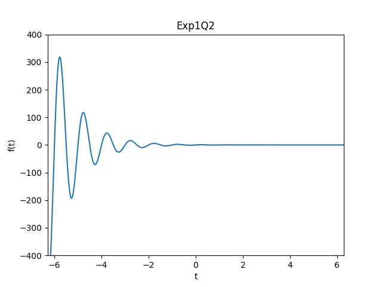
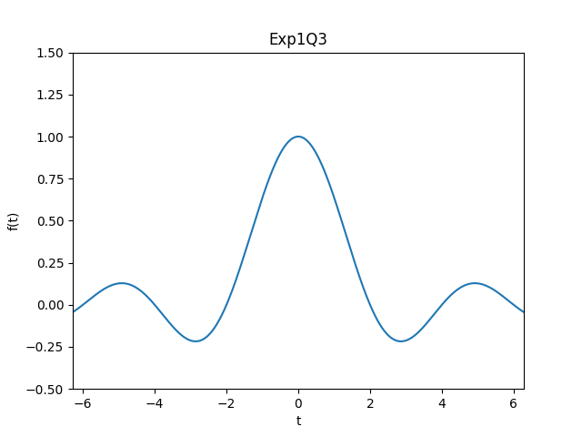
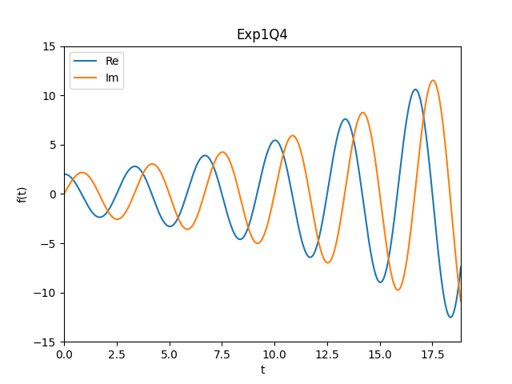
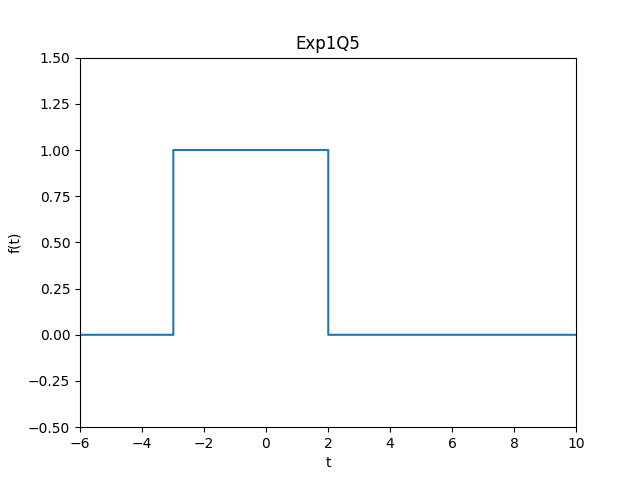
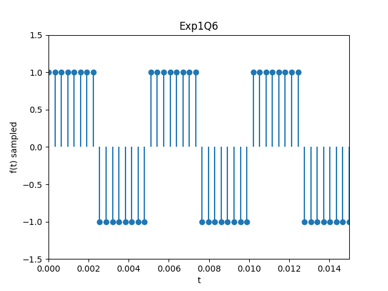
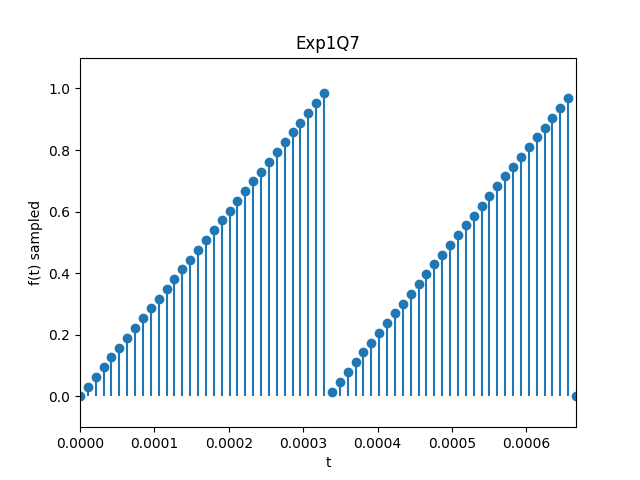

## 实验名称

连续时间信号的产生。

## 实验目的

1. 了解与掌握常用的连续时间信号有关的 MATLAB 子函数。
2. 初步掌握各种常用信号在 MATLAB 中程序的编写方法。
3. 进一步了解基本绘图方法和常用的绘图子函数。

## 实验原理

### 1. 连续时间信号的数字化表示

连续时间信号 $x(t)$ 是在连续时间范围内定义的信号。在计算机仿真（如 MATLAB 或 Python/NumPy）中，由于机器处理的是离散数据，我们通常通过在时间轴上建立极密的采样点来近似表示连续信号。只要采样间隔 $\Delta t$ 足够小（采样频率足够高），所得的离散序列在绘图展示时便可以被视为“连续”信号。

在绘图实现上，对于平滑变化的信号，常使用线性插值绘图函数（如 `plot`）；而对于具有跳变特征的信号（如阶跃信号），则通常采用阶梯状绘图函数（如 `stairs` 或 `step`）来更准确地描述其特性。

### 2. 典型连续时间信号的数学模型

实验中涉及的几种基本信号其数学定义如下：

*   **单位冲激信号 $\delta(t)$**：在 $t=0$ 时刻具有无穷大强度，且全时域积分为 1。可通过极窄、极高且面积为 1 的矩形脉冲进行近似。
  
*   **单位阶跃信号 $u(t)$**：在 $t \geq 0$ 时为 1，其余为 0。
  
*   **指数类信号**：实指数信号 $K e^{at}$，反映信号的指数级增长或衰减；复指数信号 $K e^{(a+jb)t} = K e^{at}(\cos bt + j \sin bt)$，其包含两个正交分量，是描述振荡系统的基础。
*   **周期性波形**：正弦波是最基本的周期信号，表达式为 $A \cos(\omega t + \phi)$；矩形波及锯齿波则是非正弦周期信号，常通过信号的周期性取余运算或专门的子函数（如 `square`, `sawtooth`）产生。
*   **抽样信号 (Sa 函数)**：定义为 $\text{Sa}(t) = \frac{\sin t}{t}$，其归一化形式为 $\frac{\sin(\pi t)}{\pi t}$。


## 实验任务、过程及结果分析

### 1. 绘制 $f(t) = \delta(t-2) + \delta(t-4), 0 < t < 10$ 的波形

此函数是由两个单位冲激函数组成的，在 t=2 和 t=4 处有脉冲。于是只需产生两个冲激函数并将它们相加即可。

```python
t = np.linspace(0, 10, 1000)
signal = np.zeros_like(t)
# dt = 0.1, area = 1
# delta(t-2):
delta_mask1 = (t >= 1.95) & (t <= 2.05)
signal[delta_mask1] = 10
# delta(t-4):
delta_mask2 = (t >= 3.95) & (t <= 4.05)
signal[delta_mask2] = 10

plt.figure()
plt.plot(t, signal)
plt.xlim(0, 10)
plt.ylim(-1, 11)
plt.xlabel("t")
plt.ylabel("f(t)")
plt.title("Exp1Q1")
```

或等价 MATLAB 代码：

```matlab
t = 0:0.01:10;
signal = zeros(size(t));
% delta(t-2):
delta_mask1 = (t >= 1.95) & (t <= 2.05);
signal(delta_mask1) = 10;
% delta(t-4):
delta_mask2 = (t >= 3.95) & (t <= 4.05);
signal(delta_mask2) = 10;
figure;
plot(t, signal);
xlim([0 10]);
ylim([-1 11]);
xlabel('t');
ylabel('f(t)');
title('Exp1Q1');
```

结果如图 1 所示：


<center>图 1 f(t) = δ(t-2) + δ(t-4) 波形</center>

### 2. 绘制 $f(t) = e^{-t} \sin(2 \pi t), -2\pi < t < 2\pi$ 的波形

此函数是一个指数衰减的正弦波信号。

```python
t = np.linspace(-2 * np.pi, 2 * np.pi, 1000)
f = np.exp(-t) * np.sin(2 * np.pi * t)

plt.figure()
plt.plot(t, f)
plt.xlim(-2 * np.pi, 2 * np.pi)
plt.ylim(-400, 400)
plt.grid(True)
plt.xlabel("t")
plt.ylabel("f(t)")
plt.title("Exp1Q2")
```

或等价 MATLAB 代码：

```matlab
t = linspace(-2*pi, 2*pi, 1000);
f_t = exp(-t) .* sin(2*pi*t);

figure;
plot(t, f_t);
xlim([-2*pi, 2*pi]);
ylim([-400, 400]);
xlabel('t');
ylabel('f(t)');
title('Exp1Q2');
```

结果如图 2 所示：



<center>图 2 f(t) = e^{-t} sin(2πt) 波形</center>

### 3. 绘制 $f(t) = \frac{\sin(\pi t / 2)}{(\pi t / 2)}, (-2\pi < t < 2\pi)$ 的波形

此函数为抽样信号形式。

```python
t = np.linspace(-2 * np.pi, 2 * np.pi, 1000)
f = np.sinc(t / 2)  # numpy.sinc is sin(pi*x)/(pi*x)

plt.figure()
plt.plot(t, f)
plt.xlim(-2 * np.pi, 2 * np.pi)
plt.xlabel("t")
plt.ylabel("f(t)")
plt.title("Exp1Q3")
```

或等价 MATLAB 代码：

```matlab
t = -2*pi:0.01:2*pi;
f = sinc(t/2); % MATLAB sinc is sin(pi*x)/(pi*x)
figure;
plot(t, f);
xlim([-2*pi 2*pi]);
xlabel('t');
ylabel('f(t)');
title('Exp1Q3');
```

结果如图 3 所示：



<center>图 3 f(t) = sinc(t/2) 波形</center>

### 4. 绘制 $f(t) = 2 e^{(0.1 + j0.6\pi)t}, (0 < t < 6\pi)$ 的波形

此函数为复指数信号，其实部和虚部分别为指数增长的余弦和正弦信号。

```python
t = np.linspace(0, 6 * np.pi, 1000)
real_part = 2 * np.exp(0.1 * t) * np.cos(0.6 * np.pi * t)
imag_part = 2 * np.exp(0.1 * t) * np.sin(0.6 * np.pi * t)

plt.figure()
plt.plot(t, real_part, label="Re")
plt.plot(t, imag_part, label="Im")
plt.legend()
plt.xlim(0, 6 * np.pi)
plt.xlabel("t")
plt.ylabel("f(t)")
plt.title("Exp1Q4")
```

或等价 MATLAB 代码：

```matlab
t = 0:0.01:6*pi;
ft = 2 * exp((0.1 + 1j*0.6*pi) * t);
figure;
plot(t, real(ft), 'DisplayName', 'Re');
hold on;
plot(t, imag(ft), 'DisplayName', 'Im');
legend;
xlim([0 6*pi]);
xlabel('t');
ylabel('f(t)');
title('Exp1Q4');
```

结果如图 4 所示，图中，蓝色曲线为实部，橙色曲线为虚部。



<center>图 4 复指数信号波形</center>

### 5. 绘制 $f(t) = u(t+3) - u(t-2), (-6 < t < 10)$ 的波形

此函数对应一个矩形脉冲，范围在 $[-3, 2)$。

```python
t = np.linspace(-6, 10, 1000)
f = np.where((t >= -3) & (t < 2), 1, 0)

plt.figure()
plt.step(t, f, where="post")
plt.xlim(-6, 10)
plt.ylim(-0.5, 1.5)
plt.xlabel("t")
plt.ylabel("f(t)")
plt.title("Exp1Q5")
```

或等价 MATLAB 代码：

```matlab
t = -6:0.01:10;
f = (t >= -3) & (t < 2);
ylim([-0.5 1.5]);
xlabel('t');
ylabel('f(t)');
title('Exp1Q5');
```

结果如图 5 所示：



<center>图 5 矩形脉冲波形</center>

### 6. 产生矩形方波 ($f=200\text{Hz}$, 16 points/period, 3 periods)

```python
f = 200  # Hz
T = 1 / f
num_samples_per_period = 16
num_periods = 3
total_samples = num_periods * num_samples_per_period
t = np.linspace(0, num_periods * T, total_samples)

# Square
square_wave = np.where((t % T) < T / 2, 1, -1)

plt.figure()
plt.stem(t, square_wave, basefmt=" ")
plt.xlim(0, num_periods * T)
plt.title("Exp1Q6")
```

或等价 MATLAB 代码（使用 `square` 函数）：

```matlab
f = 200;
T = 1/f;
dt = T/16;
t = 0:dt:(3*T-dt);
x = sign(sin(2*pi*f*t)); % Simple square

figure;
stem(t, x, 'fill');
xlim([0 3*T]);
ylim([-1.5 1.5]);
xlabel('t');
ylabel('f(t) sampled');
title('Exp1Q6');
```

结果如图 6 所示：



<center>图 6 矩形方波采样</center>

### 7. 产生锯齿波 ($f=3\text{kHz}$, 32 points/period, 2 periods, Amp 0~1)

```python
f = 3000  # Hz
T = 1 / f
num_samples_per_period = 32
num_periods = 2
total_samples = num_periods * num_samples_per_period
t = np.linspace(0, num_periods * T, total_samples)

# Sawtooth
sawtooth = (t % T) / T

plt.figure()
plt.stem(t, sawtooth, basefmt=" ")
plt.xlim(0, num_periods * T)
plt.title("Exp1Q7")
```

或等价 MATLAB 代码（使用 `sawtooth` 函数）：

```matlab
f = 3000;
T = 1/f;
dt = T/32;
t = 0:dt:(2*T-dt);
x = mod(t, T)/T; % Simple sawtooth 0-1

figure;
stem(t, x, 'fill');
xlim([0 2*T]);
ylim([-0.1 1.1]);
xlabel('t');
ylabel('f(t) sampled');
title('Exp1Q7');
```

结果如图 7 所示：



<center>图 7 锯齿波采样</center>

## 实验收获及心得体会

通过本次实验，我主要学习了如何使用计算机产生并绘制各种典型的连续时间信号。有以下几点特别的收获：

1. 我理解了计算机中并非真正存在“连续的”信号，而是通过高密度的等间隔采样来模拟连续性。
2. 除了使用 MATLAB，我还使用了 Python (NumPy/Matplotlib) 复现实验逻辑，我发现两者在信号处理逻辑上具有高度相似性。
3. 通过编程实现 $f(t) = e^{-t} \sin(2\pi t)$ 等复合信号，我直观地观察到了指数包络对振荡信号幅度的调制作用，以及复指数信号在复平面投影下的物理意义（实部为余弦，虚部为正弦）。
4. 规范了对坐标轴说明（`xlabel`, `ylabel`）、图例（`legend`）以及标题（`title`）的添加，养成了良好的可视化习惯。
5. 巩固了信号与系统理论课中关于典型信号数学表达式的知识基础。
