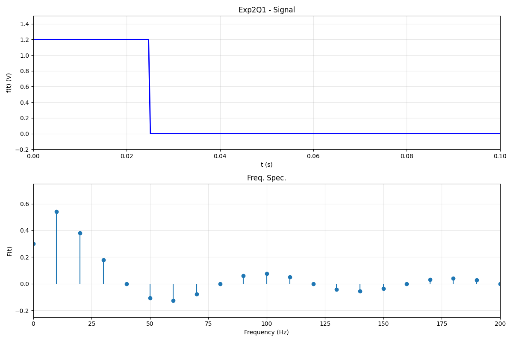
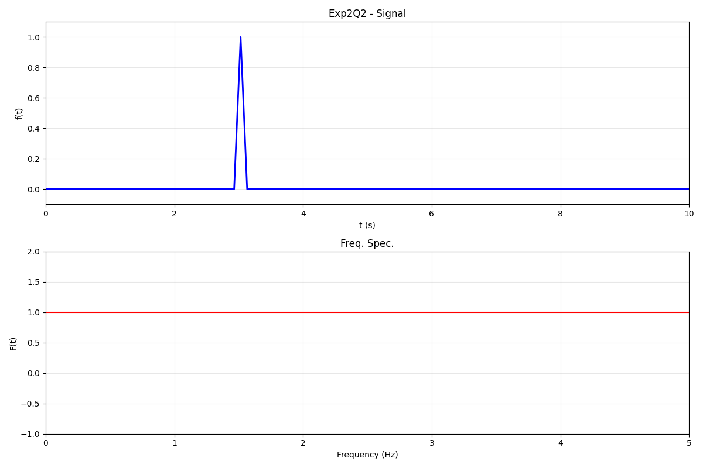
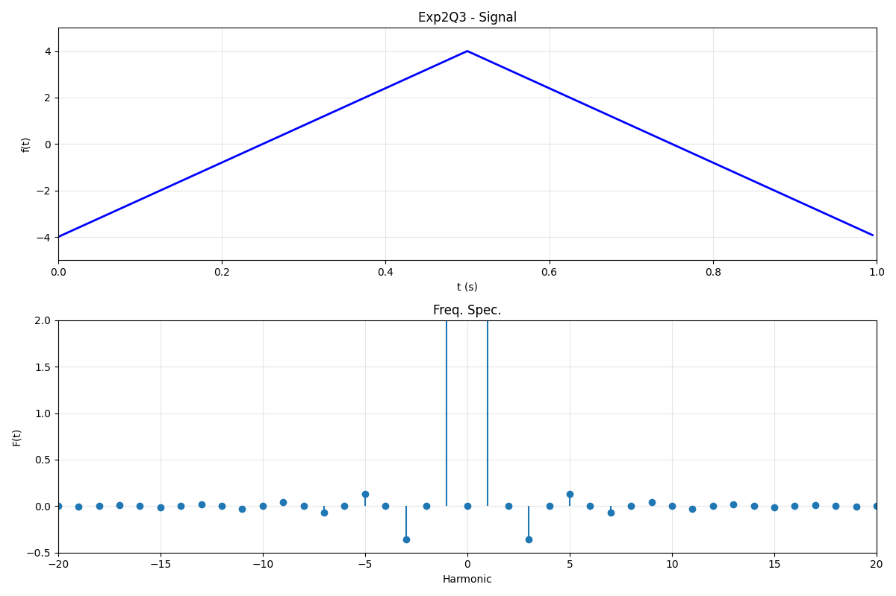
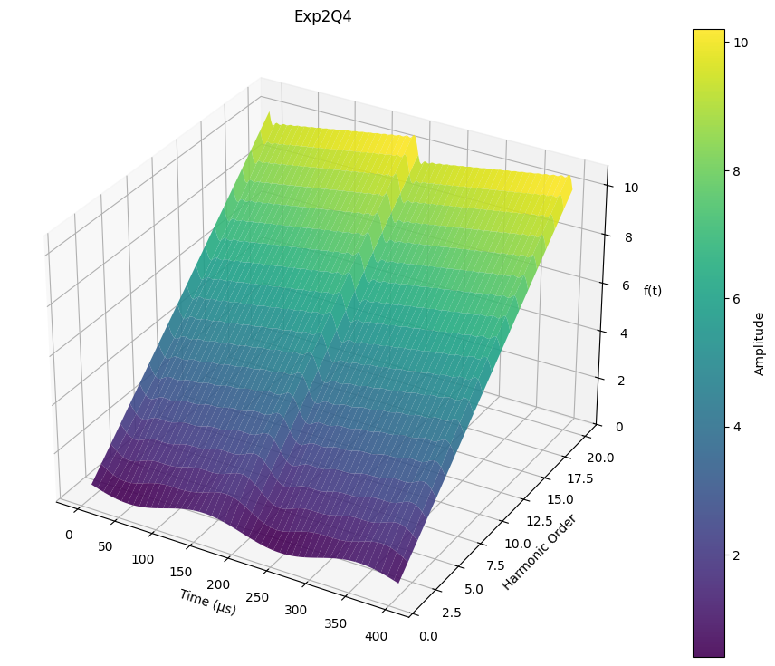
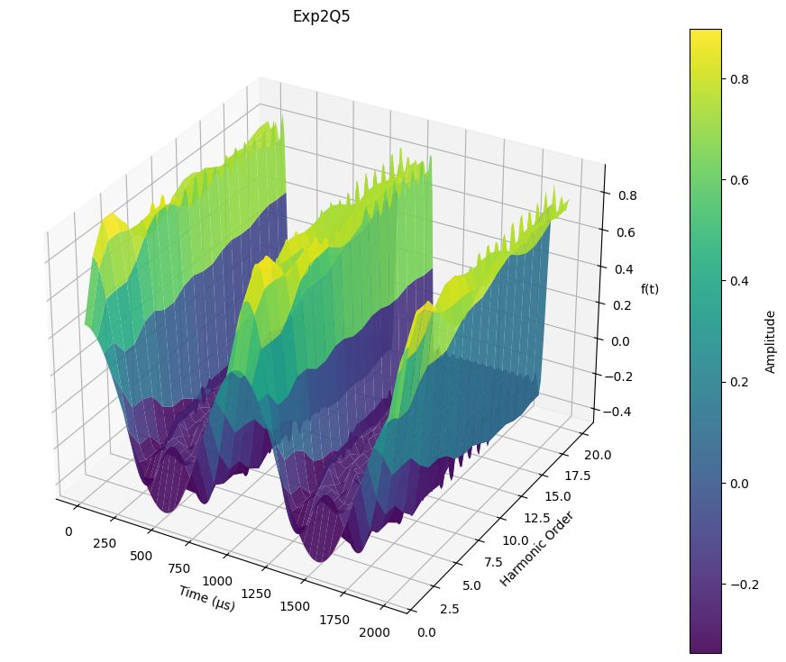

## 实验名称

连续时间信号的傅里叶分析。

## 实验目的

1. 复习傅里叶分析的基本概念，初步掌握 MATLAB 中连续时间信号频谱的分析方法。
2. 熟悉 MATLAB 有关傅里叶分析的子函数。
3. 用 MATLAB 图形观察吉布斯效应。

## 实验原理

### 1. 信号的频域分解理论

任何满足狄利克莱条件的信号均可以分解为不同频率正弦分量的线性组合，这是信号频域分析的核心思想。

*   **周期信号与傅里叶级数**：
    对于周期为 $T$ 的连续信号 $f(t)$，其可以通过傅里叶级数展开为一系列离散频率分量（谐波）：
    $$ f(t) = a_0 + \sum_{n=1}^{\infty} [a_n \cos(n\omega_0 t) + b_n \sin(n\omega_0 t)] $$
    或者使用复指数形式：
    $$ f(t) = \sum_{n=-\infty}^{\infty} F_n e^{j n \omega_0 t} $$
    这表明周期信号的频谱是离散的，且谱线间隔为基波频率 $\omega_0 = 2\pi/T$。

*   **非周期信号与傅里叶变换**：
    为了将非周期信号“视作”周期信号来处理，我们只需让信号周期趋近于无穷大，此时，谱线间隔趋于零，离散频谱转化为连续频谱。此时定义傅里叶变换及其逆变换为：
    $$ F(\omega) = \int_{-\infty}^{\infty} f(t) e^{-j\omega t} dt $$
    $$ f(t) = \frac{1}{2\pi} \int_{-\infty}^{\infty} F(\omega) e^{j\omega t} d\omega $$

### 2. 连续信号的计算机离散化处理

虽然理论针对的是连续时间信号，但在 MATLAB 或 Python 等数值计算环境中，必须对信号进行离散化和窗口化处理：

*   **离散化**：将连续时间 $t$ 变为离散采样点 $t_k = k T_s$。这会使得原本的连续频谱变为周期延拓的频谱（会导致混叠现象，需满足奈奎斯特采样定理）。
*   **窗口化**：计算机无法处理无限长的信号，通常截取有限长度时间窗口进行分析。对于周期信号，截取整数个周期可以准确获得其频谱结构；对于非周期信号，截断可能导致频谱泄漏。

在实验中，我们通常采用数值积分法近似计算傅里叶系数，或者利用快速傅里叶变换 (FFT) 算法来高效计算离散频谱采样。

### 3. 吉布斯效应

理论上，傅里叶级数需无限项叠加才能完全重建原连续信号。但在实际工程中，我们只能取有限项级数近似。当原信号存在间断点（如矩形波的跳变沿）时，截断高频分量会导致重构波形在间断点附近出现不可消除的振荡过冲，这种现象称为吉布斯效应 (Gibbs Phenomenon)。随着谐波次数增加，振荡的频率通过变快，但最大过冲幅度保持不变（约 9%）。

## 实验任务、过程及结果分析

### 1. 矩形脉冲信号的频谱分析

**任务**：已知一矩形脉冲信号，幅度 $E=1.2\text{V}$，周期 $T=100\text{ms}$，脉冲宽度与信号周期比为 $\tau/T = 1/4$。进行 256 点的采样，显示时域信号和 0~20 次谐波频段的频谱特性。

此任务通过计算傅里叶级数系数来绘制离散频谱。

```python
E = 1.2
T = 0.1  # ms
tau = 1 / 4 * T
num_samples = 256
t = np.linspace(0, T, num_samples)
f_t = np.zeros_like(t)
f_t[t < tau] = E

# Harmonics calculation
harmonics = 21
frequencies = np.arange(harmonics) / T
amplitudes = np.zeros(harmonics)
# DC Component
amplitudes[0] = E * tau / T
# AC Components
n = np.arange(1, harmonics)
arg = n * np.pi * tau / T
# Coefficient formula for rectangular wave
amplitudes[1:] = E * tau / T * np.sin(arg) / arg * 2

plt.figure()
plt.subplot(2, 1, 1)
plt.plot(t, f_t)
plt.title("Exp2Q1 - Signal")
plt.subplot(2, 1, 2)
plt.stem(frequencies, amplitudes, basefmt=" ")
plt.title("Freq. Spec.")
```

或等价 MATLAB 代码：

```matlab
E = 1.2;
T = 0.1; 
tau = T / 4;
% 时域波形
t = linspace(0, T, 256);
ft = zeros(size(t));
ft(t < tau) = E;

% 频域计算 (0-20次谐波)
n = 0:20;
freqs = n / T;
% 矩形波傅里叶系数公式: An = (E*tau/T) * Sa(n*pi*tau/T) * 2 (for n>0)
% MATLAB sinc(x) = sin(pi*x)/(pi*x)
Ak = (E * tau / T) * sinc(n * tau / T); 
Ak(2:end) = Ak(2:end) * 2; % 单边谱非直流分量乘2

figure;
subplot(2,1,1);
plot(t, ft, 'b', 'LineWidth', 1.5);
xlim([0 T]); ylim([-0.2 1.5]);
title('Exp2Q1 - Time Domain'); xlabel('t (s)');

subplot(2,1,2);
stem(freqs, Ak, 'filled');
xlabel('Frequency (Hz)'); ylabel('Amplitude (V)');
title('Exp2Q1 - Frequency Spectrum');
```

结果如图 1 所示：



<center>图 1 矩形脉冲信号及其频谱</center>

### 2. 单位冲激信号的频谱分析

**任务**：已知一个单位冲激信号 $\delta(t-3)$，在 $0 < t < 10$ 的范围内用 100 点作图，显示原时域信号及其频谱图。

理论上 $\delta(t-t_0)$ 的傅里叶变换模长为常数 1（全频带谱）。

```python
t = np.linspace(0, 10, 100)
f_t = np.zeros(100)
f_t[30] = 1 # Simulate delta at t=3
freq = np.linspace(0, 5, 100)
magnitude = np.ones_like(freq)

plt.figure()
plt.subplot(2, 1, 1)
plt.plot(t, f_t)
plt.title("Exp2Q2 - Signal")
plt.subplot(2, 1, 2)
plt.plot(freq, magnitude)
plt.title("Freq. Spec.")
```

或等价 MATLAB 代码：

```matlab
t = linspace(0, 10, 100);
ft = zeros(size(t));
% 模拟脉冲
[~, idx] = min(abs(t - 3));
ft(idx) = 1;

% 频域幅值 (理论值为1)
freq = linspace(0, 5, 100);
F_mag = ones(size(freq));

figure;
subplot(2,1,1);
plot(t, ft);
title('Exp2Q2 - Impulse Signal');

subplot(2,1,2);
plot(freq, F_mag);
ylim([0 2]);
title('Exp2Q2 - Magnitude Spectrum');
```

结果如图 2 所示：



<center>图 2 单位冲激信号及其频谱</center>

### 3. 周期性三角波信号的频谱分析

**任务**：已知一个周期性三角波信号频率为 $1\text{Hz}$，幅度 $E=4\text{V}$。取其一个周期的时间信号，进行 200 点的采样，显示原时域信号和 -20~20 次谐波频段的频谱特性。

```python
f = 1  # Hz
T = 1 / f
num_samples = 200
t = np.linspace(0, T, num_samples, endpoint=False)
# Triangular Construction
period = t % T
f_t = np.where(period < T / 2, 16 * period - 4, -16 * (period - T / 2) + 4)

harmonics = np.arange(-20, 21)
amplitudes = np.zeros(len(harmonics))
# Calculate coefficients based on triangular wave series formula
for k in range(21):
    n = 2 * k + 1 # Only odd harmonics exist
    if n <= 20:
        sign = (-1) ** k
        amp = 32 / (np.pi**2 * n**2) * sign
        idx_neg = 20 - n
        idx_pos = 20 + n
        amplitudes[idx_neg] = amp
        amplitudes[idx_pos] = amp

plt.figure()
plt.subplot(2, 1, 1)
plt.plot(t, f_t)
plt.title("Exp2Q3 - Signal")
plt.subplot(2, 1, 2)
plt.stem(harmonics, amplitudes, basefmt=" ")
plt.title("Freq. Spec.")
```

或等价 MATLAB 代码：

```matlab
f = 1; T = 1/f;
t = linspace(0, T, 200);
ft = sawtooth(2*pi*f*t, 0.5) * 4;

n_harm = -20:20;
An = zeros(size(n_harm));
for i = 1:length(n_harm)
    n = abs(n_harm(i));
    if mod(n, 2) == 1
        k = (n-1)/2;
        An(i) = (32 / (pi^2 * n^2)) * (-1)^k;
        An(i) = An(i) / 2; 
    end
end

figure;
subplot(2,1,1);
plot(t, ft);
title('Exp2Q3 - Triangular Wave');

subplot(2,1,2);
stem(n_harm, An * 2, 'filled');
title('Exp2Q3 - Spectrum');
```

结果如图 3 所示，上方子图为时域三角波信号，下方子图为其频谱。



<center>图 3 周期三角波及其频谱</center>

### 4. 吉布斯效应观察

**任务**：用三维网格图显示下列脉冲信号的前 20 次谐波相叠加的情况，观察吉布斯现象。
1.  周期性锯齿波：$E=1\text{V}, f_1=5\text{kHz}$。
2.  周期性矩形信号：$\tau/T_1 = 1/4, E=1\text{V}, f_1=1\text{kHz}$。

此实验通过逐步累加有限个傅里叶级数项，在三维空间展示波形随谐波次数增加而逐渐逼近原波形的过程，尤其是在不连续点的过冲现象。

#### 4.1 锯齿波吉布斯效应

```python
E = 1
f = 5000
T = 1 / f
num_harmonics = 20
t = np.linspace(0, 2 * T, 200)
harmonics = np.arange(1, num_harmonics + 1)
T_grid, H_grid = np.meshgrid(t, harmonics)

# Calculate sum of harmonics
accumulated = np.zeros_like(T_grid, dtype=float)
# ... Loop partial sums ...

fig = plt.figure()
ax = fig.add_subplot(111, projection="3d")
ax.plot_surface(T_grid, H_grid, accumulated, cmap="viridis")
```

#### 4.2 矩形波吉布斯效应

```python
# 矩形波生成算法略

fig = plt.figure()
ax = fig.add_subplot(111, projection="3d")
ax.plot_surface(T_grid, H_grid, accumulated, cmap="viridis")
```

等价 MATLAB 代码：

```matlab
E = 1; f = 5000; T = 1/f;
t = linspace(0, 2*T, 200);
max_N = 20;
harmonics = 1:max_N;
[T_grid, H_grid] = meshgrid(t, harmonics);

Accumulated = zeros(max_N, length(t));
wave_sum = zeros(size(t));

for n = 1:max_N
    % Sawtooth partial sum
    term = -(E/(n*pi)) * sin(2*pi*n*f*t);
    if n == 1
        wave_sum = E/2 + term;
    else
        wave_sum = wave_sum + term;
    end
    Accumulated(n, :) = wave_sum;
end

figure;
surf(T_grid, H_grid, Accumulated);
xlabel('Time'); ylabel('Harmonics'); zlabel('Amplitude');
title('Gibbs Phenomenon - Sawtooth');
shading interp;
```

结果如图 4 和 图 5 所示：



<center>图 4 锯齿波吉布斯效应 (3D)</center>



<center>图 5 矩形波吉布斯效应 (3D)</center>

可发现，图 4 中的锯齿波在高谐波（黄色着色区域）跳变点附近出现明显的过冲振荡，而图 5 中的矩形波则表现出更为显著的吉布斯现象，它在较低谐波区域也有显著的过冲振荡。

## 实验收获及心得体会

通过本次实验，我深入理解了连续信号频域分析的数学本质与物理意义，有效地验证了傅里叶级数理论以及吉布斯效应的存在。主要有三点体会：

1. 通过对不同波形的频谱变换，直观地看到了时域波形的跳变程度与频域谐波收敛速度之间的关系——时域越不平滑，其高频分量衰减越慢；时域越平滑，高频分量衰减越快。
2. 动态地观测到了随着谐波次数 $N$ 的增加，合成波形在跳变出的过冲现象始终存在且不随 $N$ 增大而消失。
3. 掌握了绘制三维图形的方法。
