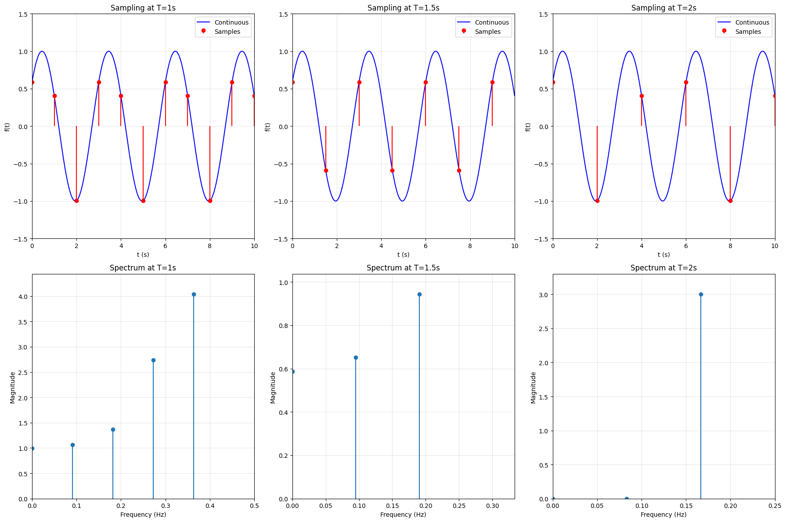
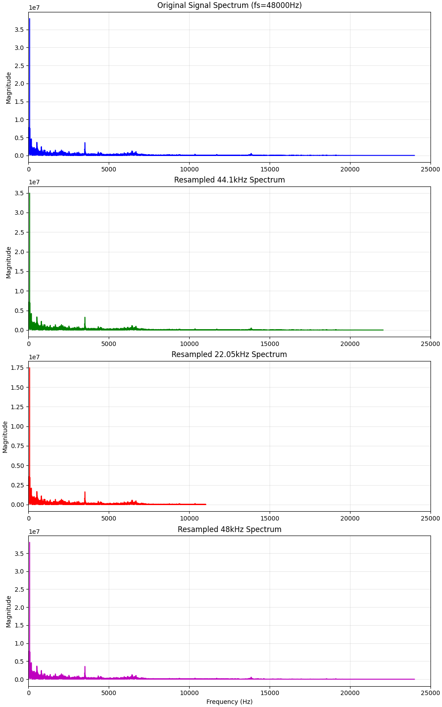
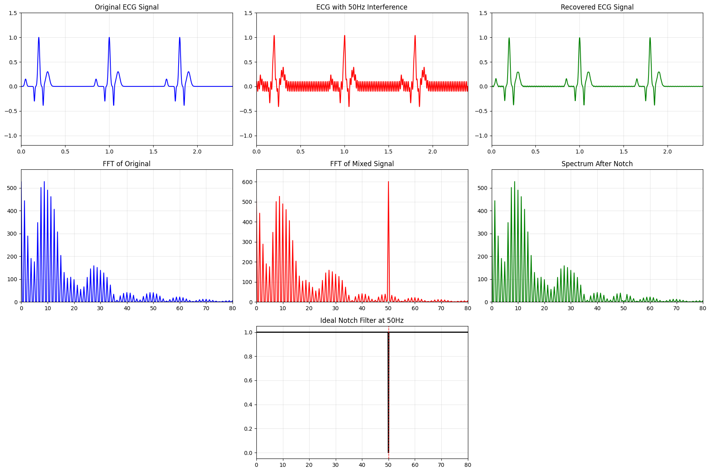
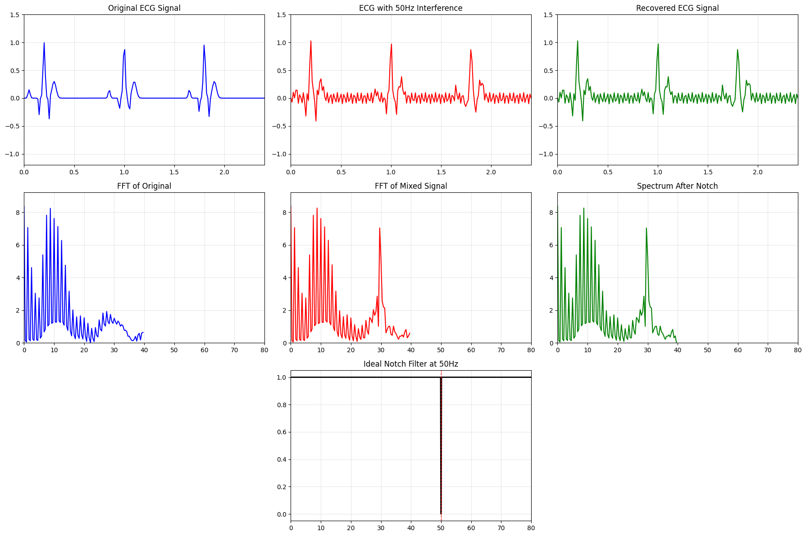

# 实验名称

信号的时域抽样与重建。

## 实验目的

1. 加深对信号时域抽样与重建基本原理的理解。
2. 了解用 MATLAB 语言进行信号时域抽样与重建的方法。
3. 观察信号抽样与重建的图形，掌握采样频率的确定和内插公式的编程方法。

## 实验原理

### 1. 采样定理

信号的采样是将连续时间信号 $x(t)$ 转换为离散时间序列 $x(n T_s)$ 的过程，其中 $T_s$ 为采样周期，$f_s = 1/T_s$ 为采样频率。

根据奈奎斯特 (Nyquist) 采样定理，为了使带限信号（最高频率为 $f_m$）能够从其采样样本中无失真地恢复，采样频率 $f_s$ 必须满足：
$$ f_s \geq 2 f_m $$
或者说采样间隔 $T_s$ 必须满足 $T_s \leq \frac{1}{2 f_m}$。

### 2. 频谱混叠

连续信号经过采样后，其频谱 $X_s(f)$ 是原信号频谱 $X(f)$ 以采样频率 $f_s$ 为周期进行延拓和叠加的结果：
$$ X_s(f) = \frac{1}{T_s} \sum_{n=-\infty}^{\infty} X(f - n f_s) $$

*   **不混叠**：当 $f_s \geq 2 f_m$ 时，频谱的各个延拓副本之间互不重叠，此时可以通过低通滤波器完整提取出原信号频谱，从而恢复原信号。
*   **混叠**：当 $f_s < 2 f_m$ 时，频谱的延拓副本发生重叠，高频分量“伪装”成了低频分量，导致无法通过线性滤波恢复出原始信号，这种现象称为频谱混叠。

### 3. 信号的重建

信号重建是采样的逆过程，即由离散样本恢复连续波形。

*   **频域角度**：在满足采样定理的前提下，将采样信号通过一个截止频率为 $f_s/2$、增益为 $T_s$ 的理想低通滤波器，滤除高频延拓分量，保留基带频谱。
*   **时域角度**：时域上表现为采样脉冲序列与理想低通滤波器冲激响应（Sinc 函数）的卷积。重建公式（Whittaker–Shannon 插值公式）为：
    $$ x(t) = \sum_{n=-\infty}^{\infty} x(n T_s) \cdot \text{sinc}\left( \frac{t - n T_s}{T_s} \right) $$
    其中 $\text{sinc}(u) = \frac{\sin(\pi u)}{\pi u}$。这也是 MATLAB 中利用插值函数进行波形平滑重建的理论基础。

## 实验任务、过程及结果分析

### 1. 不同采样频率下的信号采样与频谱分析

**任务**：已知信号 $f(t) = \sin\left(\frac{2}{3}\pi t + \frac{\pi}{5}\right)$，当取样间隔分别为 $T_s=1\text{s}$、$T_s=1.5\text{s}$ 和 $T_s=2\text{s}$ 时，利用 MATLAB 仿真绘制出取样信号序列及其频谱。

**Python 代码实现**：

```python
def f(t):
    return np.sin(2 * np.pi * t / 3 + np.pi / 5)

t_continuous = np.linspace(0, 10, 1000)
f_continuous = f(t_continuous)
T_values = [1, 1.5, 2]
labels = ['T=1s', 'T=1.5s', 'T=2s']

plt.figure(figsize=(18, 12))
for i, (T, label) in enumerate(zip(T_values, labels)):
    # 采样
    t_samples = np.arange(0, 10.1, T)
    f_samples = f(t_samples)
    
    # 时域绘图
    plt.subplot(2, 3, i + 1)
    plt.plot(t_continuous, f_continuous, 'b-', alpha=0.5, label='Continuous')
    plt.stem(t_samples, f_samples, linefmt='r-', markerfmt='ro', basefmt=' ', label='Samples')
    plt.title(f'Sampling at {label}')
    plt.xlabel('t (s)')
    plt.legend()
    
    # 频域绘图 (FFT)
    fs = 1 / T
    N = len(f_samples)
    freq = np.fft.rfftfreq(N, d=T)
    mag = np.abs(np.fft.rfft(f_samples))
    
    plt.subplot(2, 3, i + 4)
    plt.stem(freq, mag, basefmt=' ')
    plt.title(f'Spectrum at {label}')
    plt.xlabel('Frequency (Hz)')
    plt.grid(True, alpha=0.3)
```

或等效 MATLAB 代码：

```matlab
% 定义信号函数
f = @(t) sin(2 * pi * t / 3 + pi / 5);
t_cont = 0:0.01:10;
f_cont = f(t_cont);

T_values = [1, 1.5, 2];
figure('Position', [100, 100, 1200, 600]);

for i = 1:3
    T = T_values(i);
    Ts_label = sprintf('T=%.1fs', T);
    
    % 采样
    t_samples = 0:T:10;
    f_samples = f(t_samples);
    
    % 时域子图
    subplot(2, 3, i);
    plot(t_cont, f_cont, 'b', 'LineWidth', 1); hold on;
    stem(t_samples, f_samples, 'r', 'filled');
    title(['Sampling at ' Ts_label]);
    xlabel('t (s)'); ylabel('f(t)');
    legend('Continuous', 'Samples');
    hold off;
    
    % 频域子图 (FFT)
    subplot(2, 3, i + 3);
    Fs = 1/T;
    N = length(f_samples);
    Y = fft(f_samples);
    P2 = abs(Y/N);      % 双边谱幅值
    P1 = P2(1:floor(N/2)+1);   % 单边谱
    P1(2:end-1) = 2*P1(2:end-1);
    f_axis = Fs*(0:(N/2))/N;
    
    stem(f_axis, P1, 'filled');
    title(['Spectrum at ' Ts_label]);
    xlabel('Frequency (Hz)'); ylabel('|P1(f)|');
    grid on;
end
```

结果如图 1 所示（Python 生成结果）：



<center>图 1 不同采样间隔下的时域采样与频谱对比</center>

**结果观察**：
1.  **T=1s (Fs=1Hz)**：$f_{sig} = 0.33\text{Hz}$ 位于 $f_s/2 = 0.5\text{Hz}$ 之内。频谱图上可以清晰看到在 $0.33\text{Hz}$ 附近有峰值，未发生混叠。
2.  **T=1.5s (Fs=0.66Hz)**：$f_{sig} = 0.33\text{Hz}$ 恰好等于 $f_s/2$。此时处于临界状态，时域上每周期只有两个采样点。
3.  **T=2s (Fs=0.5Hz)**：$f_s/2 = 0.25\text{Hz}$。原信号频率 $0.33\text{Hz}$ 高于折叠频率。在频谱图上，原频率分量会折叠到 $|0.5 - 0.33| = 0.17\text{Hz}$ 处，出现明显的混叠（假频），此时无法从采样点恢复原信号。

### 2. 真实音频信号的采样与重采样分析

**任务**：利用 MATLAB 仿真绘制原始音乐信号和取样信号的频谱；适当调整采样信号的频率（降低），直到音乐听起来发生失真，若采样频率为 22 kHz，分析信号频谱的变化情况；适当调整采样信号的频率（提高），分析信号频谱的变化情况，在对这段音乐进行试听，感觉效果如何？

对于此任务，我选取了一段原始采样率为 48kHz 的音频文件进行分析，分别将其重采样到了 44.1kHz，22.05kHz 和 48kHz，并生成了对应的重采样音频文件。

从听感来说，22.05kHz 采样率下的音频明显失真，缺乏高音部分的细节，声音变得闷沉；而 44.1kHz 和 48kHz 采样率下的音频听感较好且质量相似，只凭人耳不太能区分出二者的区别。

**Python 代码实现**：

```python
import scipy.io.wavfile as wavfile
import scipy.signal as signal

def q2():
    # 读取原始音频并转化为单声道
    fs_orig, data_orig = wavfile.read("input/996839315.wav")
    if data_orig.ndim > 1:
        data_orig = data_orig.mean(axis=1)
    data_float = data_orig.astype(float)

    def resample_and_save(target_fs, filename):
        num_samples = int(len(data_float) * target_fs / fs_orig)
        resampled = signal.resample(data_float, num_samples)
        out = np.clip(resampled, -32768, 32767).astype(np.int16)
        wavfile.write(filename, target_fs, out)
        return resampled

    d_441 = resample_and_save(44100, "output/996839315.44100.wav")
    d_22 = resample_and_save(22050, "output/996839315.22050.wav")
    d_48 = resample_and_save(48000, "output/996839315.48000.wav")

    # ... 绘图部分略
```

或等效 MATLAB 代码：

```matlab
% 读取原始音频并转化为单声道
[data, fs_orig] = audioread('input/996839315.wav');
if size(data, 2) > 1, data = mean(data, 2); end

target_rates = [44100, 22050, 48000];
out_suffixes = {'44100.wav', '22050.wav', '48000.wav'};

figure;
for i = 1:4
    if i == 1
        curr_data = data; curr_fs = fs_orig;
        title_str = ['Original Signal (', num2str(curr_fs), 'Hz)'];
    else
        curr_fs = target_rates(i-1);
        % 使用 MATLAB resample 函数进行重采样
        curr_data = resample(data, curr_fs, fs_orig);
        audiowrite(['output/996839315.', out_suffixes{i-1}], curr_data, curr_fs);
        title_str = ['Resampled to ', num2str(curr_fs), 'Hz'];
    end
    
    % 频谱分析
    N = length(curr_data);
    window = hanning(N);
    Y = fft(curr_data .* window);
    P = abs(Y(1:floor(N/2)+1));
    freqs = (0:floor(N/2)) * (curr_fs / N);
    
    subplot(4, 1, i);
    plot(freqs, P);
    title(title_str); xlim([0 25000]);
    xlabel('Frequency (Hz)'); ylabel('Magnitude');
end
```

**实验结果**：

结果如图 2 所示，从上至下分别是原始音频频谱、44.1kHz 采样频谱、22.05kHz 采样频谱和 48kHz 采样频谱，横轴均缩放至 25kHz 以便观察和分析。



<center>图 2 音频信号在不同采样率下的频谱对比</center>

从频谱图中可以看出，原始频谱和 48kHz 采样（以原始音频的采样率进行采样）均展示了音频的全频带特征。值得注意的是，22.05kHz 采样的截止频率明显降低至约 11kHz 左右（奈奎斯特频率）。如果原信号在 11kHz 以上有能量，这部分能量会被滤除或折叠，在听感上表现为高音细节的丢失（声音变闷）。

### 3. 基于傅里叶分析的心电信号(ECG)工频干扰消除

**背景**：在医院的心电监护中，ECG 信号非常微弱且极易受到来自供电电源的 50Hz 工频干扰。这种干扰在时域上表现为叠加在心跳波形上的高频“毛刺”。

**任务**：模拟一个类 ECG 的周期性脉冲信号（心率为 75bpm），并叠加 50Hz 正弦波干扰。要求利用 FFT 将混合信号转换到频域，设计理想陷波器滤除 50Hz 分量，再通过 IFFT 恢复信号。

**Python 代码实现**：

```python
def q3(freq_sample: int = 5000):
    # 模拟 ECG 信号 (高斯脉冲合成)
    # 生成 P, Q, R, S, T 波过程略 ...

    # 叠加 50Hz 干扰
    interference = 0.1 * np.sin(2 * np.pi * 50 * t)
    mixed_signal = ecg_signal + interference

    # FFT 变换
    fft_mixed = np.fft.fft(mixed_signal)
    freq = np.fft.fftfreq(len(t), 1/fs)

    # 理想陷波器 (直接将 50Hz 处分量置零)
    idx_50 = np.argmin(np.abs(freq - 50))
    idx_neg50 = np.argmin(np.abs(freq + 50))
    fft_filtered = fft_mixed.copy()
    fft_filtered[idx_50] = 0
    fft_filtered[idx_neg50] = 0
    
    # IFFT 恢复
    recovered = np.real(np.fft.ifft(fft_filtered))
    
    # 绘图过程略 ...
```

或等效 MATLAB 代码：

```matlab
% 模拟 ECG 信号
fs = 5000; T = 0.8; 
t = linspace(0, 3*T, floor(fs * 3 * T));
ecg = zeros(size(t));

gauss = @(t, A, mu, sig) A * exp(-((t - mu).^2) / (2 * sig^2));
for k = 0:2
    offset = k*T;
    ecg = ecg + gauss(t, 0.15, 0.05+offset, 0.01) + ...
                gauss(t, -0.3, 0.15+offset, 0.005) + ...
                gauss(t, 1.0, 0.2+offset, 0.01) + ...
                gauss(t, -0.4, 0.25+offset, 0.005) + ...
                gauss(t, 0.3, 0.3+offset, 0.02);
end

% 50Hz 干扰
mixed = ecg + 0.1 * sin(2 * pi * 50 * t);

% FFT
N = length(t);
freq_axis = (0:N-1)*(fs/N);
fft_mixed = fft(mixed);

% 陷波 (Zero out 50Hz)
[~, idx_50] = min(abs(freq_axis - 50));
idx_neg50 = N - idx_50 + 2;
fft_mixed(idx_50) = 0;
fft_mixed(idx_neg50) = 0;

% Recover
recovered = real(ifft(fft_mixed));

% Plot results...
```

**实验结果**：

结果如图 3 所示，蓝色、红色、绿色的图形分别代表原始 ECG 信号、混合了 50Hz 工频干扰的信号以及经过频域滤波恢复后的信号。



<center>图 3 ECG 信号的工频干扰消除 (时域与频域对比)</center>

从图中可以清晰地观察到，混合信号的频谱图在 50Hz 处出现了一个尖锐的强峰，这精确对应了工频干扰的频率；通过理想陷波器的处理，时域上的高频“毛刺”被彻底清除；恢复后的 ECG 信号与原始信号几乎完全重合（绿色曲线），说明在心电信号的主要能量频段（通常 <40Hz）与 50Hz 干扰没有重叠的情况下，频域滤波是一种极其高效且无失真的去噪手段。

**问答：**

1. 低频段代表什么？低频段通常包含信号的主要形态信息，如心电信号中的 PQRST 波形。
2. 50Hz 处有什么现象？50Hz 处出现了一个显著的频谱峰值，代表工频干扰的存在。
3. 50Hz 处的现象验证了傅里叶变换的什么性质？验证了傅里叶变换中频域表示信号频率成分的性质，特定频率的干扰在频谱中表现为峰值。
4. 如果将采样率降低到 80Hz，还能成功消除干扰吗？为什么？不能。因为根据采样定理，采样率必须至少为信号中最高频率成分的两倍。50Hz 的干扰在 80Hz 采样下会发生混叠，无法通过频域滤波有效去除。

请看图 4，展示了采样率在 80Hz 下的频谱情况。我们可以看到 40Hz 以上的频率成分已经不再可见，50Hz 干扰已经混叠到低频段，自然无法通过简单的陷波器去除（可以发现，恢复后的信号仍然带有“毛刺”）。



<center>图 4 采样率 80Hz 下的 ECG 信号频谱</center>

## 实验收获及心得体会

通过本次实验，我深入理解了信号抽样和重建的过程。有以下体会：

1.  实验直观地展示了，当采样频率过低时，离散序列既丢失了原信号的波形细节，也在频域上产生无法区分的假频。并且直观地验证了奈奎斯特定律。
2.  通过对音乐音频在不同采样率下的重采样和试听，直观地感受到了采样率对音质的影响。
3.  通过对 ECG 信号的工频干扰去除实验，理解了频域滤波的原理和实际应用效果。
