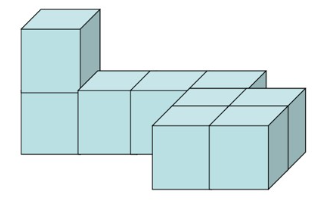

第三次作业

## 交互技术

**问：请列出你所熟悉的软件系统（例如 Microsoft Office）涉及到的交互技术，若有本章中没有提及的交互技术，请对其进行进一步分析。**

答：以 Microsoft Office 软件为例。

1. **WIMP界面**：
   - 作为主要运行于 Microsoft Windows 操作系统的应用软件，Office 采用了 Windows 系统惯用的 WIMP 界面。具体而言，软件通过窗口（Window）的形式向用户传递视觉信息，通过图标（Icon）来便利用户对操作的检索和认知，通过菜单（Menu）来收纳和归类各种操作，通过指点设备（Pointing Device）来允许用户进行输入。
2. **几何约束与引力场**：
   - 通过对几何图形的方向、形状和位置进行校准，Office 允许用户在带有人为误差的情况下精确地操作几何图形。
3. **橡皮筋与操作柄**：
   - 通过使用指点设备，用户能够轻松地对几何图形进行缩放等变换，而无需手动输入具体的数值，这实现了“所见即所得”的友好交互效果。
4. **笔交互技术**：
   - 以 PowerPoint 为例，在幻灯片放映时，软件允许用户通过笔设备来进行标记和翻页等操作，属于自然交互技术的一种。

-----

**问：绘制下图的三视图。**



答：

> 主视图

```
□
□ □ □ □ □
```

> （左）侧视图

```
□
□ □ □
```

> 俯视图

```
□ □ □ □
      □ □
      □ □
```
